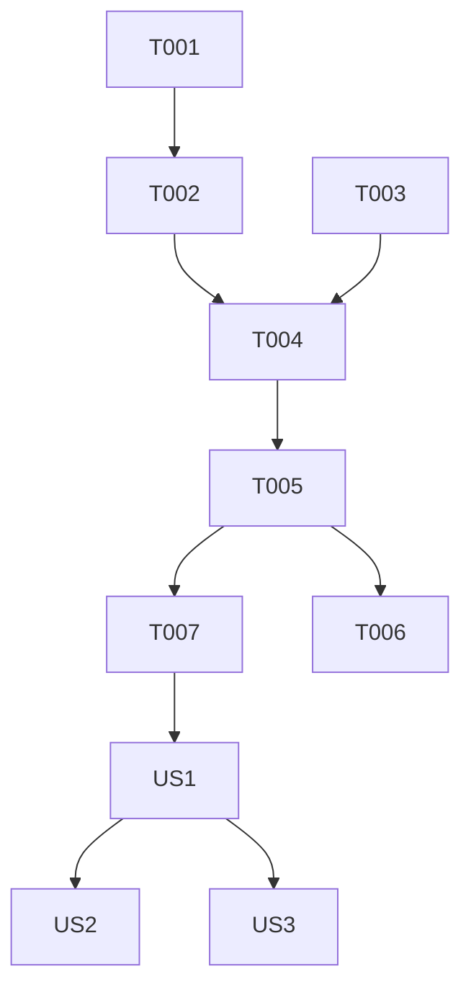

# Tasks: Score Estimation WASM (Feature 134)

**Input**: Design documents from `specs/134-score-estimation-wasm/`
**Prerequisites**: plan.md (required), spec.md (required for user stories)

**Organization**: Tasks are grouped by user story to enable independent implementation and testing of each story.

## Format: `[ID] [P?] [Story] Description`

- **[P]**: Can run in parallel (different files, no dependencies)
- **[Story]**: Which user story this task belongs to (e.g., US1, US2, US3)
- Include exact file paths in descriptions

## Phase 1: Setup (Shared Infrastructure)

**Purpose**: Project initialization and asset placement

- [ ] T001 [P] Create directory for WASM assets at `frontend/public/wasm/`
- [ ] T002 [P] Place `OGSScoreEstimator-0.7.0.wasm` and `OGSScoreEstimator-0.7.0.js` in `frontend/public/wasm/`
- [ ] T003 [P] Create type definitions for estimation results in `frontend/src/types/scoreEstimation.ts`

---

## Phase 2: Foundational (Blocking Prerequisites)

**Purpose**: Core WASM service and module management

**⚠️ CRITICAL**: No user story work can begin until the WASM module can be loaded and called.

- [ ] T004 Implement `ScoreEstimationService` for loading and wrapping the WASM module in `frontend/src/services/scoreEstimationService.ts`
- [ ] T005 Implement memory management utilities (`_malloc`, `_free`) and board-to-buffer conversion logic in `frontend/src/services/scoreEstimationService.ts`
- [ ] T006 [P] Create unit tests for board-to-buffer conversion in `frontend/tests/unit/services/scoreEstimationService.test.ts`
- [ ] T007 Implement the `useScoreEstimation` hook to provide estimation results to components in `frontend/src/hooks/useScoreEstimation.ts`

**Checkpoint**: Foundation ready - board states can be successfully estimated in isolation.

---

## Phase 3: User Story 1 - Ownership Heatmap (Priority: P1) 🎯 MVP

**Goal**: Provide a visual indication of territory ownership on the board.

**Independent Test**: Toggle "Analyze" button and see translucent markers on empty intersections.

### Implementation for User Story 1

- [ ] T008 [P] [US1] Create `OwnershipOverlay` component at `frontend/src/components/GobanBoard/OwnershipOverlay.tsx`
- [ ] T009 [US1] Integrate `OwnershipOverlay` into the main `GobanBoard` component in `frontend/src/components/GobanBoard/GobanBoard.tsx`
- [ ] T010 [US1] Implement a "Toggle Analysis" button in `frontend/src/components/PuzzleSetPlayer/PuzzleControls.tsx` (or equivalent controls component)
- [ ] T011 [US1] Connect board state to `useScoreEstimation` with 1000 trials when analysis is active in `frontend/src/components/PuzzleSetPlayer/PuzzleSetPlayer.tsx`
- [ ] T012 [US1] Add basic CSS for ownership markers (e.g., small squares with `rgba` colors) in `frontend/src/styles/ownership.css`

**Checkpoint**: User Story 1 is functional: users can see a territory heatmap.

---

## Phase 4: User Story 2 - Score Lead Estimation (Priority: P2)

**Goal**: Show a numerical lead estimate (e.g., "Black +10.5").

**Independent Test**: Verify info panel shows score lead when analysis is active.

### Implementation for User Story 2

- [ ] T013 [P] [US2] Add a `ScoreLeadDisplay` component to show current estimation results in `frontend/src/components/Puzzle/ScoreLeadDisplay.tsx`
- [ ] T014 [US2] Integrate `ScoreLeadDisplay` into the puzzle info panel or status bar in `frontend/src/components/PuzzleSetPlayer/PuzzleSetPlayer.tsx`
- [ ] T015 [US2] Update `ScoreEstimationService` to calculate lead by summing ownership and applying Komi in `frontend/src/services/scoreEstimationService.ts`

**Checkpoint**: User Story 2 is functional: users see the score lead.

---

## Phase 5: User Story 3 - Exploratory Analysis (Priority: P3)

**Goal**: Allow estimation even after incorrect moves.

**Independent Test**: Play a wrong move, then toggle analysis to see the new state's heatmap.

### Implementation for User Story 3

- [ ] T013 [US3] Ensure `useScoreEstimation` captures the current _volatile_ board state (off-path moves) instead of just the fixed SGF state in `frontend/src/hooks/useScoreEstimation.ts`
- [ ] T014 [US3] Add a "What went wrong?" shortcut button after a failure that activates Analysis Mode.

---

## Phase 6: Polish & Cross-Cutting Concerns

**Purpose**: Optimization and cleanup

- [ ] T015 [P] Implement throttling or debounce for estimation calls during drag-and-drop or fast play in `frontend/src/hooks/useScoreEstimation.ts`
- [ ] T016 [P] Add a "High Quality" analysis option (5000+ trials) in settings.
- [ ] T017 [P] Final CSS polish for heatmap markers to ensure visibility on all board themes.

---

## Dependency Graph

## Parallel Execution Opportunities

- T001, T003 (Infrastructure)
- T012 (CSS) can be done alongside UI implementation
- T013 (US2 component) can be designed while T012 is being finished
